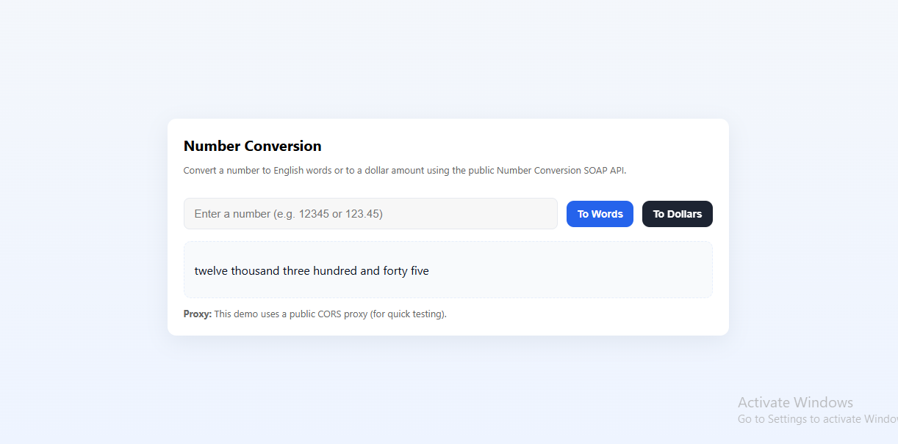
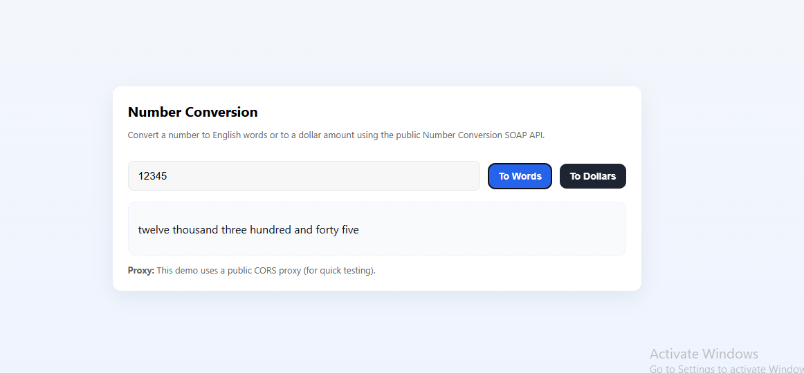
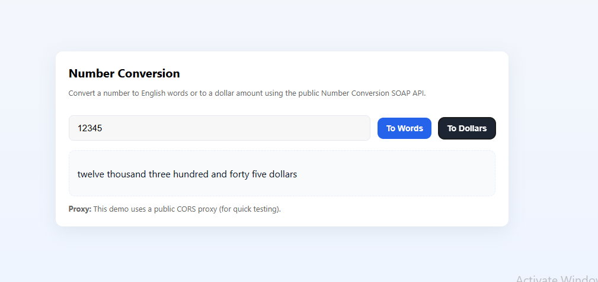

# 🔢 Number Conversion (SOAP API)

A simple **Number Conversion Web App** that uses the free [DataAccess SOAP API](https://www.dataaccess.com/webservicesserver/NumberConversion.wso) to:
- Convert numbers to **English words**
- Convert numbers to **Dollar amounts**

All processing happens in the browser using JavaScript, with a CORS proxy to bypass cross-origin restrictions.

---

## 🚀 Features
- Convert integers and decimals to **words**
- Convert integers and decimals to **US dollar format**
- SOAP request/response handling in JavaScript
- Input validation with user-friendly error messages
- Responsive, minimal UI built with CSS
- Runs entirely on the frontend (no backend required)
- Integrated **CORS proxy** for quick testing

---

## 🛠️ Tech Stack
- **HTML5** – Structure  
- **CSS3** – Styling & layout  
- **JavaScript (ES6+)** – SOAP API calls & logic  
- **SOAP API** – Number conversion service  
- **CORS Proxy** – Bypass cross-origin restrictions  

---

## 📂 Project Structure
📦 number-conversion
├── index.html # Main HTML file
├── style.css # Styling
├── script.js # App logic & SOAP API calls
└── README.md # Project documentation


---

## 🔗 API Details
**Base URL**  
https://www.dataaccess.com/webservicesserver/NumberConversion.wso

**Methods Used**:
- `NumberToWords` — Converts numbers to words
- `NumberToDollars` — Converts numbers to USD format

**CORS Proxy Used**:
https://corsproxy.io/?url=

---

## 💻 Usage
1. **Clone the repository**  
   ```bash
   git clone https://github.com/yourusername/number-conversion-soap.git
Navigate to the project folder
cd number-conversion-soap
Open in browser
Open index.html directly in your browser.
Convert a number
Enter a number in the input field (e.g., 12345 or 123.45)
Click "To Words" or "To Dollars"


🖼 Preview





